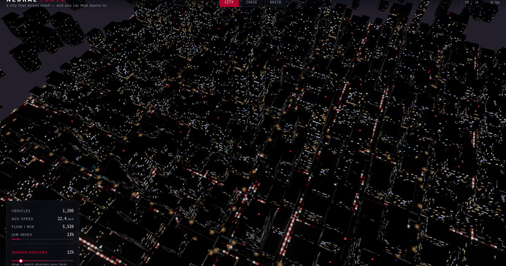

# NEURAL TOKYO

**Google Earth, but alive.** The real, photorealistic Shibuya — streaming as Google 3D Tiles — with 1,000 vehicles driving on the real road network, and one crimson car teaching itself to drive from the photoreal pixels. In a browser tab. No engine, no server.



## Two builds

| File | What it is |
|---|---|
| **`tokyo-live.html`** ⭐ | The real thing. Google Photorealistic 3D Tiles of Shibuya + live traffic simulation on OpenStreetMap roads + a neural driver, with a 6-shot cinematic auto-tour. Needs a Google Map Tiles API key: open with `?key=YOUR_KEY`. |
| `index.html` | The offline sibling: a fully procedural night-Shibuya (real OSM roads & building footprints, hand-built geometry). No API key, works anywhere, single file. |

## Run the live build

```
tokyo-live.html?key=YOUR_MAP_TILES_KEY
```

Get a key: Google Cloud Console → enable **Map Tiles API** → create an API key. Photorealistic 3D Tiles is usage-billed; set a daily quota cap and a budget alert to stay in control (this project caps renderer requests at 13,000/day).

Controls: keys `1`–`6` jump between shots, `space` toggles auto-play. URL params: `?cam=fixed`, `?shot=N`, `?hq` (higher tile detail), `?record=45` (auto-downloads a 45-second WebM), `?human=0.8` (driver mix).

## The six shots

1. **DESCENT** — fall out of the sky onto the real Shibuya scramble.
2. **THE CROSSING** — 1,000 cars flowing through the real street grid with real traffic physics.
3. **STREET LEVEL** — down among the buildings; IDM car-following + signal-timed intersections.
4. **FOLLOW** — chase the crimson car as it drives itself along real lanes.
5. **BRAIN** — the neural net takes the wheel and learns, live: its 48×16 camera input, every neuron firing, the imitation loss falling, autonomy climbing.
6. **ASCEND** — pull back up over the whole living city.

## What is honestly real

- **The city**: Google's Photorealistic 3D Tiles — actual aerial photogrammetry of Shibuya, streamed and rendered by [`3d-tiles-renderer`](https://github.com/NASA-AMMOS/3DTilesRendererJS). Not modeled. Not faked.
- **The roads**: the real Shibuya network from OpenStreetMap — real geometry, lane counts, one-way rules, and signal positions. Vehicles sit on the photogrammetry by raycasting the tiles for ground height.
- **The traffic**: the Intelligent Driver Model (Treiber et al., 2000), the standard car-following model in traffic science, plus signal-timed intersection arbitration. "Human" drivers differ only by longer headways, ~0.65 s reaction, and random brake taps — so phantom jams emerge, as on real roads.
- **The driver**: a 769→48→24→2 MLP (38,186 parameters), forward pass *and* backprop hand-written in plain JS. Input is the real pixels of a WebGL render from the car's bumper (downsampled to 48×16 grayscale) plus speed. Output is steering + acceleration. It's trained by behavioral cloning of a pure-pursuit + IDM teacher, with DAgger-style takeovers when it drifts off lane. No TensorFlow. No rules.
- **Not real**: this is a toy homage, not production autonomy. It's ALVINN (1989) reborn on top of Google Earth — a love letter to the idea that a camera and a network are enough to learn the road.

## Why this shape

[Turing Inc.](https://tur.ing) builds camera-first, end-to-end autonomous driving for Tokyo — the bet that driving intelligence lives in the brain, not the sensor stack. This is that idea at 1/1,000,000 scale, running on the actual streets of Shibuya.

## Reproduce the trick

Four small pieces, all liftable:
1. stream Google Photorealistic 3D Tiles into three.js with `3d-tiles-renderer` + `GoogleCloudAuthPlugin`;
2. raycast the tiles (three-mesh-bvh) to place a simulation on the real ground;
3. render the agent's POV to a tiny render target and read the pixels;
4. a hand-rolled MLP + backprop imitating a classical controller, with a takeover rule.

## Credits

Built with **Claude** (Anthropic). Imagery © Google. Road data © OpenStreetMap contributors. Traffic model: Treiber, Hennecke & Helbing (2000). Ancestor: Pomerleau's ALVINN (1989). MIT License (code only; tile imagery is Google's under its own terms).
